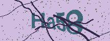
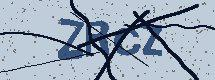
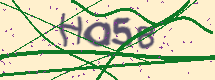
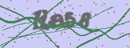

# A captcha solver for National Bureau of Statistics

At the time when I'm writing this `readme.md`, it seems that NBS(National Bureau of Statistics) has stopped using the captcha, before I try to actually to use this solver🙄. Anyway, this repo is present as a reference about a captcha solver(cracker) experiment to write a new captcha generator rather than a dedicated captcha "processor".

I had implemented two classes of captcha solver few years ago, utilizing classic image processing and tesseract(SVM) or Deep Network with labeled characters. This time I want to implement a captcha generator to define a captcha distribution, then just train a Deep Network on it without any labeled data (I still labeled 50 samples to automate the test, but those data are not used in training). So if the generator matches the true captcha generator enough, it's expected that the model which has performed well on simulated distribution will work well on real captcha as well. And even if the model works badly, we at least got a decent captcha generator.

## The generator

Random background (color is drawn from GMM), random font, font size, position independent noise, correlated noise, affine transform (rotation), plastic deform, line, and noise points are considered. The parameters are tuned by me comparing the result with the target, while some GAN may be useful but I just wants to write a captcha generator from scratch and tune it manually for fun.


| True sample |  |  |  |  |
|-----|-----|-----|-----|----|
| Generated |  |  |  |  |


## The model

CTC model is used, the implementation is just a copy from [ypwhs's code](https://github.com/ypwhs/captcha_break/blob/master/ctc_pytorch.ipynb). The principle is shown in following ASCII art:

```
Original Captcha image:
-----------------|
|                |
|    A B  C D    |
|                |
|----------------|
  CNN   |
        |  
 Feature| map
-------------------
| | | | | | | | | |
-------------------
| | | | | | | | | |
-------------------
Reshape |
        | 
Feature | Seq
-------------------
| | | | | | | | | |
| | | | | | | | | |
-------------------
 LSTM   | FC
        |
Prob Vec| argmax
-------------------
|-|-|A|B|-|C|-|D|-|
-------------------
Filter  |
        |
Output  |
------------------
       ABCD
------------------
```

## Performance

| In Generator (word, train) | True samples (word, test) | True Samples (Char, test) |
|-----|-----|-----|
| 85% | 24% | 61% |

Well, it's not good compared to a more "supervised" model, while I have not spent more effort to try to tune it. But anyway the `24%` may be good enough, if the crawler and targeted website doesn't care about a few independent times test, for example, 5 tests will lead to `1-(1-0.24)^5=74.6%` probability of success.

## Try on Colab

So it's a yet another time that colab can be used on project other than MNIST🤔.

* evaluate.ipynb [notebook](evaluate.ipynb) [colab](https://colab.research.google.com/drive/14hNVuULwYmDzvwB8AbBP_0czUCYLJo2i?usp=sharing)
* train.ipynb [notebook](train.ipynb) [colab](https://colab.research.google.com/drive/12SPkxr3uHESQTdGbNVBpgEvRy-7b9Z6Y?usp=sharing)
